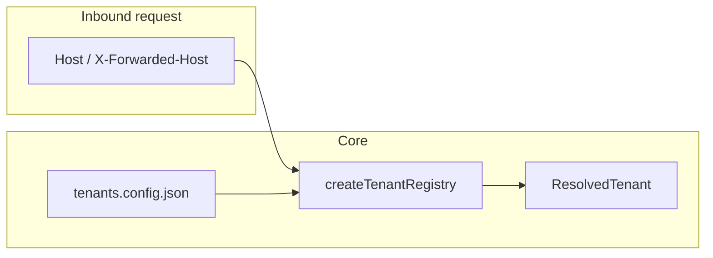
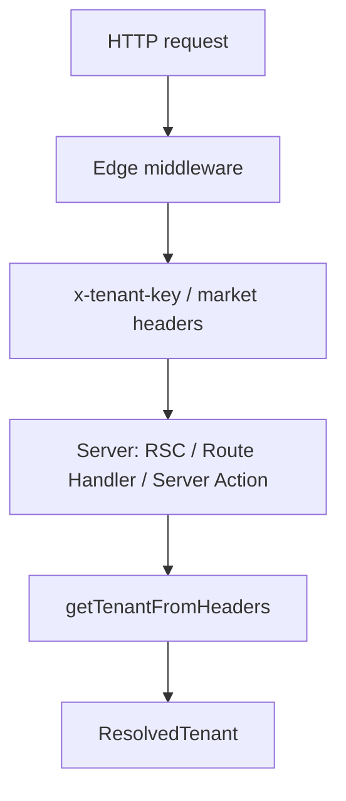

# Why Multitenant — and when not to use it

## What this stack optimizes for

- **Host-based (or header-assisted) tenant resolution** from a **single config file** shared across services.
- **Markets** shared across tenants (locale, currency, timezone) without duplicating boilerplate.
- **Typed errors** and small **framework adapters** so you do not fork `ResolvedTenant` per app.

## Host → registry → tenant

**Resolution is not authentication.** Knowing the tenant from the hostname does **not** prove who the user is. Use **`@multitenant/identity`** (or your IdP) for authorization on sensitive data.

## Typical Next.js App Router path

Middleware resolves the tenant on the **Edge** and forwards stable headers; server code re-hydrates a **`ResolvedTenant`** via **`getTenantFromHeaders`** using the **same** registry module as middleware. See [Next.js App Router](/frameworks/next-app).

## When not to use

- **Tenant is purely from JWT / session**, never from host — you may still use **`TenantsConfig`** for markets, but forced routing from **`Host`** is the wrong mental model.
- **Thousands of dynamic tenants** with no stable domain map — you will fight DNS and config size; consider a DB-backed resolver (out of scope for core).
- **Edge DB / heavy Node work in middleware** — keep middleware thin; DB access belongs in **Node** runtimes (see **`@multitenant/database`** + [Getting started](/getting-started) Edge note).

## Common pitfalls

1. **`next dev` on raw `localhost`** without matching **`domains.local`** — middleware may passthrough with no tenant; use **`multitenant dev`** and hosts from your config, or **`onMissingTenant: 'throw'`** only when you control **Host**.
2. **Trusting `X-Tenant-Id` from the client** — resolve from **registry + trusted proxy headers**, then validate session if needed.
3. **Duplicating `ResolvedTenant` types** — import from **`@multitenant/core`** only.
4. **Skipping session ↔ host alignment** — if you use identity cookies, the session tenant must **match** the host-resolved tenant on mutating routes.

## Next on this site

- [Getting started](/getting-started)
- [Examples](/examples)
- [Configuration](/config)
- [Errors](/errors)
