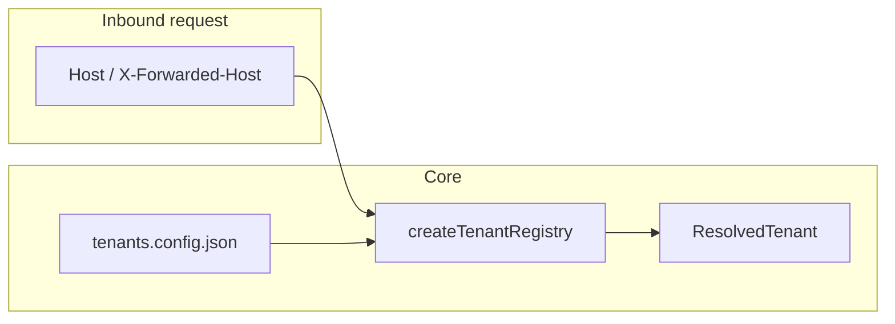

# Why Multitenant — and when not to use it

## What this stack optimizes for

- **Host-based (or header-assisted) tenant resolution** from a **single config file** shared across services.
- **Markets** shared across tenants (locale, currency, timezone) without duplicating boilerplate.
- **Typed errors** and small **framework adapters** so you don’t fork `ResolvedTenant` per app.

## Host → registry → tenant

Resolution is **not** authentication: knowing the tenant from the hostname does **not** prove who the user is. Use `@multitenant/identity` (or your IdP) for authorization on sensitive data.

## When not to use

- **Tenant is purely from JWT / session**, never from host — you may still use `TenantsConfig` for markets, but forced routing from `Host` is the wrong mental model.
- **Thousands of dynamic tenants** with no stable domain map — you’ll end up fighting DNS and config size; consider a DB-backed resolver (out of scope for this repo’s core).
- **Edge DB / heavy Node work in middleware** — keep middleware thin; DB access belongs in Node runtimes (see [database scope](INTERNAL/database-scope.md)).

## Common pitfalls

1. **`next dev` on `localhost`** without matching `domains.local` — middleware may passthrough with no tenant; use `multitenant dev` and hosts from your config or set `onMissingTenant: 'throw'` only when you control Host.
2. **Trusting `X-Tenant-Id` from the client** — resolve from **registry + trusted proxy headers**, then validate session if needed.
3. **Duplicating `ResolvedTenant` types** — import from `@multitenant/core`; canonical types live there only (`PLAN.md` Phase 1.3 audit).

## Next steps

- [Getting started](GETTING-STARTED.md)
- [Errors](INTERNAL/errors.md)
